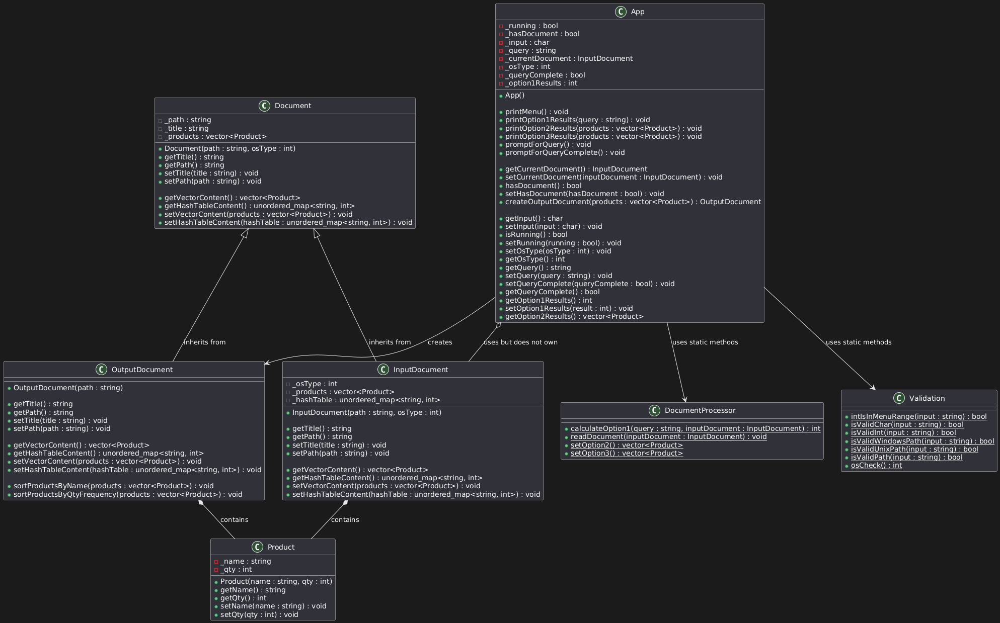

# Corner Grocer Item-Tracking Program

This project is an item-tracking program for the Corner Grocer. It analyzes text records of items purchased throughout the day to help the store rearrange its produce section based on item frequency.

## Features

- **Set Input File Path**: Allows the user to specify the file path for the input file containing purchase records.
- **Search for an Item**: Prompts the user to input an item name and returns the frequency of that specific item.
- **Print Frequency of All Items**: Prints a list with the frequency of all items purchased.
- **Print Histogram of Item Frequencies**: Displays the item frequency information as a histogram for easy visualization.
- **Backup Frequency Results**: Saves the frequency results in an output `.dat` file for backup purposes.
- **Exit the Program**: Provides the option to exit the application gracefully.

## UML Diagram

The UML diagram illustrates the structure of the program, including the relationships between classes such as `App`, `Document`, `Product`, and utility classes for validation and processing.

## Classes

### `App`

- Manages the overall application flow. This class is responsible for:
  - Displaying menus.
  - Handling user input.
  - Interacting with the documents and controlling the program's execution.
- It interacts with both `InputDocument` (for reading data) and `OutputDocument` (for writing and sorting data).
- It also utilizes static methods from the `Validation` and `DocumentProcessor` classes to validate user input and process document data.

### `Document`

- The base class for handling document-related operations. It provides common attributes such as:
  - `_path`: The file path of the document.
  - `_title`: The document's title.
  - `_products`: A collection of products in the document (represented by `Product` objects).
- Defines methods to manage document content, such as retrieving and setting both a vector of products and a hashtable (mapping product names to their quantities).

### `InputDocument` (inherits from `Document`)

- Represents the input document, responsible for reading item purchase records.
- Contains both a vector and a hashtable to store `Product` data.
- Inherits the document manipulation methods from `Document` and implements them specifically for input operations.

### `OutputDocument` (inherits from `Document`)

- Represents the output document, used for saving item frequencies or sorted product data.
- Provides additional functionality for sorting products by name or quantity frequency before saving.
- Inherits all the document handling features from the base `Document` class.

### `Product`

- Represents an item purchased at the store.
- Attributes:
  - `_name`: The name of the product.
  - `_qty`: The quantity purchased.
- Provides getter and setter methods for managing product data.

### `Validation`

- A utility class that includes **static methods** for validating user input. These methods include:
  - `intIsInMenuRange()`: Ensures that integer input is within the valid menu range.
  - `isValidChar()`, `isValidInt()`: Validates character and integer inputs, respectively.
  - `isValidPath()`, `isValidWindowsPath()`, and `isValidUnixPath()`: Validate the file paths based on the operating system.
  - `osCheck()`: Checks the operating system type to adjust path validation rules accordingly.

### `DocumentProcessor`

- Another utility class with **static methods** used for processing documents. These methods include:
  - `calculateOption1()`: Processes a query by calculating the frequency of a specific item from an `InputDocument`.
  - `readDocument()`: Reads the content of an `InputDocument`.
  - `setOption2()` and `setOption3()`: Generate specific sets of `Product` data for different program options.

## Future Enhancements

- **Enhanced Sorting**: Additional sorting criteria for products.
- **GUI Integration**: Potential development of a graphical interface to replace the command-line interface.
- **Analytics**: Add features for more advanced analytics on purchase data, such as trends over time.
